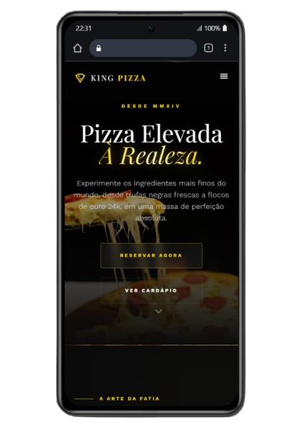
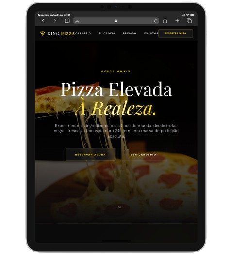

# 👑 King Pizza - A Realeza da Gastronomia Digital

  <video src="https://github.com/yamotoz/King-pizza/raw/master/img/videopizza.mp4" width="100%"></video>

## 💎 Uma Experiência de Luxo em Tempo Recorde

O projeto **King Pizza** nasceu como um estudo de caso sobre a intersecção entre a **Inteligência Artificial Generativa** e o **Design de Alta Performance**. O objetivo foi transcender o comum, criando uma presença digital que exala sofisticação, exclusividade e elegância michelin.

### 🚀 Velocidade & Maestria (The 15-Minute Challenge)
Este site não foi apenas desenvolvido; ele foi esculpido em **menos de 15 minutos**. 

Através de um fluxo de trabalho altamente otimizado, integramos visão criativa e execução técnica para entregar:
- Uma identidade visual completa.
- UI/UX focado em conversão e experiência sensorial.
- Responsividade total e fluidez de navegação.

### 🛠️ A Lógica por trás da Arte
Utilizamos o **MCP Stitch**, uma ferramenta de ponta que permitiu a criação rápida e simplificada de interfaces de usuário complexas. O foco foi manter uma **estética Premium**, utilizando técnicas modernas como:
- **Glassmorphism**: Elementos com efeito de vidro e desfoque.
- **Scrollytelling**: Animações suaves de revelação que narram a história da marca durante a rolagem.
- **Paleta Real**: O uso estratégico do *Deep Charcoal* e *Royal Gold* para criar contraste e luxo visual.

---

## 📱 Responsividade Total: Da Palma da Mão à Mesa Real

O design foi concebido sob a filosofia *True Responsive*, garantindo que a sofisticação da King Pizza seja mantida em qualquer tela.

### Mobile & Tablet Experience
A elegância não é sacrificada em telas menores. Cada botão, imagem e espaçamento foi calculado para oferecer uma navegação intuitiva e luxuosa.

| Mobile View | Tablet View |
| :---: | :---: |
|  |  |

---

## 🧪 Notas de Estudo
Este projeto demonstra o poder de ferramentas como o **MCP Stitch** para acelerar o processo de prototipagem e desenvolvimento final, permitindo que a energia criativa seja focada no que mais importa: **A experiência do usuário e a excelência visual.**

---

  <b>Projetado para a Realeza. Executado com Inteligência.</b>

